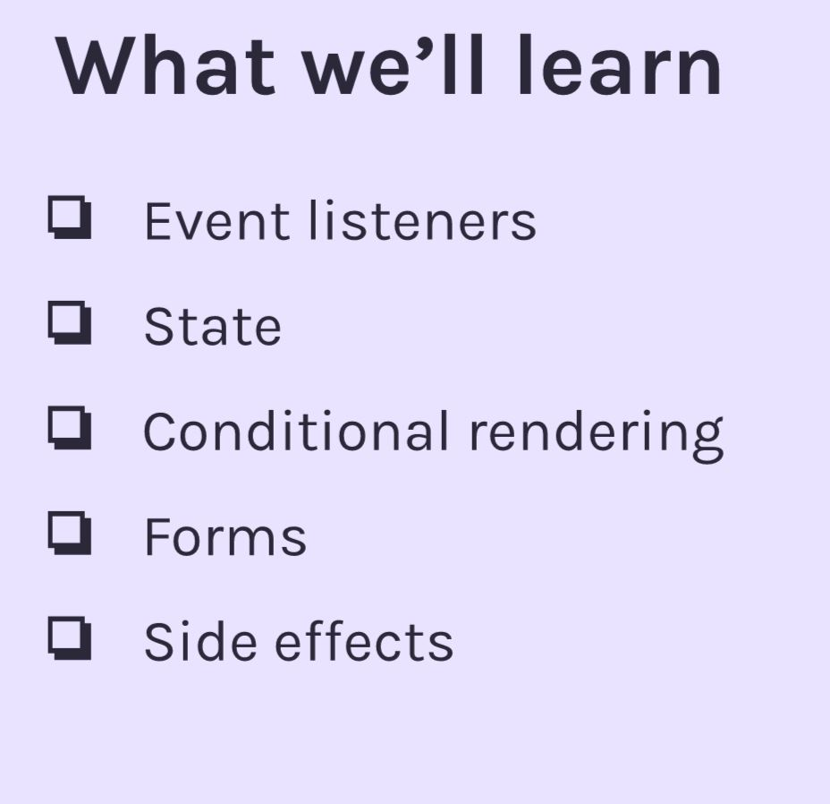

## Intro

이부분 만들면서 목표가 있다면...

- css
  에는 혼자 Tailwind를 독학해서 적용해보자.
  처음 유튭강의 보고 styled-component를 알게됐을 때 너무나 신세계 같고 즐거웠는데, styled-component도 어느정도 한계는 있었다. 정말 하나하나 다 태그로 만들어서 적용해줘야 하는...그런...불편함이랄까?호호 게으른완벽주의자 성향에서 조금 탈피중인 나이지만 조금이나마 효율성을 더 따지는 나이기에 이참에 작은 프로젝트에 tailwind를 적용하면서 배워나갈 생각이다.
- react
  

# I learned

- **pointer-events** https://reactjs.org/docs/events.html#pointer-events

## state

- **State**

  - **"Props"** refers to the properties being passed into a component in order for it to work correctly, similat to how a fuction received parameters: "from above." A component receiving props is not allowed to modify those props. (l.e. they are "immutable.")
  - **state**
    1. **How would you describe the concept of "state"?**
       A way for React to remember saved values from within a component.
       This is similar to declaring variables from within a component,
       with a few added bonuses
    2. **When would you want to use props instead of state?**
       Anytime you want to pass data into a component so that
       component can determine what will get displayed on the
       screen.
    3. **When would you want to use state instead of props?**
       Anytime you want a component to maintain some values from
       within the component. (And "remember" those values even
       when React re-renders the component).
    4. **What does "immutable" mean? Are props immutable? Is state immutable?**
       Unchanging. Props are immutable. State is mutable.
  - **Changing state**

    1. **You have 2 options for what you can pass in to a state setter function (e.g `setCount`). What are they?**

       - 1. New value of state (setCount(42))
       - 2. Callback function - whatever the callback function returns === new value of state

    2. **When would you want to pass the first option (from answer above) to the state setter function**?
       Whenever you don't need the previous value of state to determine what the new value of state should be.

    3. **When would you want to pass the second option (from answer above) to the state setter function?**
       Whenever you DO need the previous value to determine the new value

  * [you-probably-dont-need-derived-state](https://reactjs.org/blog/2018/06/07/you-probably-dont-need-derived-state.html)
