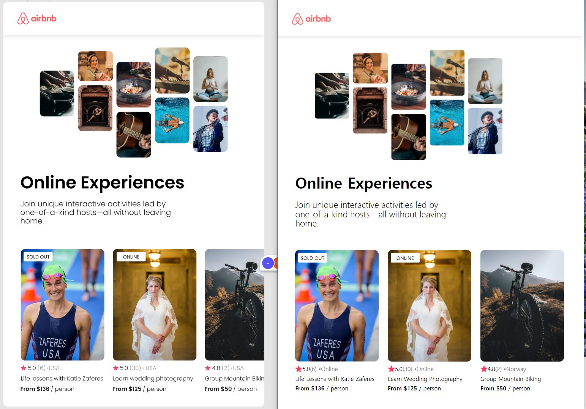

# It looks like this

left - figma / right - mine

## I learned

- **short-cricuit evaluation(단축평가)**: 논리연산자를 사용한 단축평가는 [모던 자바스크립트 Deep Dive ](https://www.aladin.co.kr/shop/wproduct.aspx?ItemId=251552545)책으로 공부하며 그냥 슥- 훓어보고 만 내용이다. 내게는 삼항연산자가 더 익숙하기도하고 '굳이 논리연산자를 왜 사용하지?' 라고 생각하며 필요성을 못느꼈었는데 쓰앵님이 그렇게 작성하시는걸 보고 나도 그렇게 작성해보니 나쁘지 않았다. 쓰앵님 말 마따나, 좀 더 'make sense'한 느낌? 아무튼...기술책은 그냥 읽는 것으로 끝내서 되는게 아니라 한 자라도 직접 타이핑/끄적임을 해야함을 또 느꼈다.

- **flex**: 플렉스...에 대하여 7%정도의 학습 레벨을 갖고 있던 나인데 이번 프로젝트를 작성하면서 그 원리에 대하여 좀 더 익숙해지게 된 기분이다. [요 url이](https://d2.naver.com/helloworld/8540176) 큰 도움이 됐다.
- **css details**:
  공간 wrapping을 기초 설계시 잘 해놓으면 spacing하기가 수월하다는 것을 배웠다. 뭐 물론 나 처럼 작성중에 불현듯 깨닫고 난 후 부랴부랴 컴포넌트로 추가 wrapping하는 사람들도 있겠지만...ㅎ...
- **map()**: map(), slice(), join(), spread operator등을 다시 한번 되새겨보았다.

## I tried

- **styled-component**: 통 css파일에 다 때려박아서 적용하는 css를 좋아하지 않아서 전체 css파일에 코드를 다 작성하는 방식 말고 styled-component를 좀더 사용하는 방식으로 css를 적용해보았다.
- **figma**: 이런 사이트 존재조차 몰랐던 라떼인간이 바로나다!^^. 사용하는 방법도 재밌고 협업할 수 있다는 것도 재밌었다. 나의 웹에 참고하여 적용할 부분에 대한 정보를 쉽게 간파 할 수 있다는 점이 좋았다. 이번 AirBnB페이지 작업하면서 처음 사용해 보았는데, 아주 기분 좋은 경험으로 남게 됐다.
