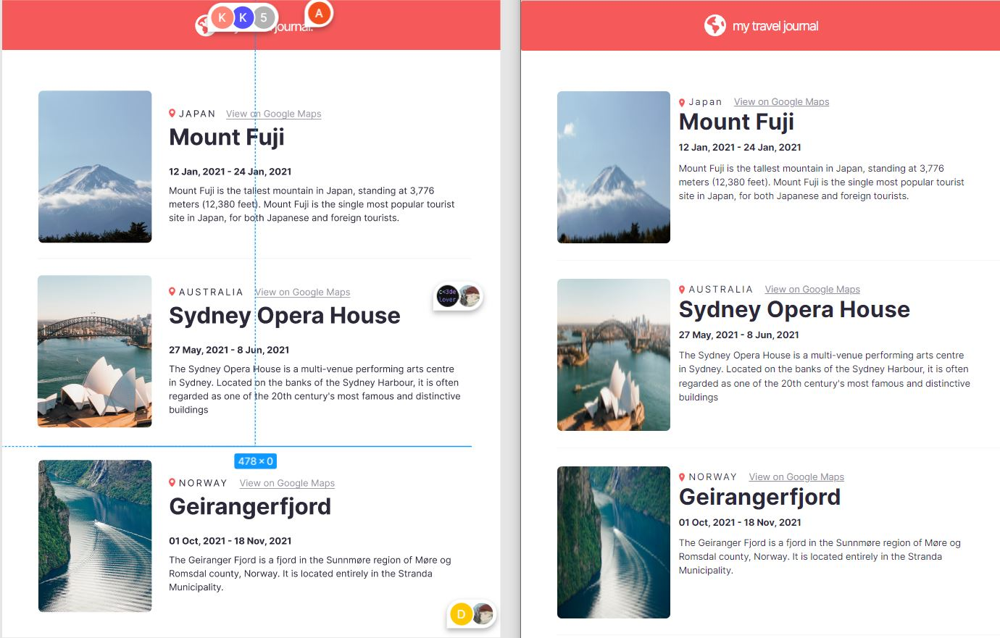

# It looks like this

left - figma / right - mine

## I learned

- **components, props**:
  어떤 언어에서든... 결국에는 복잡하게 그냥 나열된 긴 코드를 가장 단순하고 작은 핵심요소로 이루어진 모듈로 만드는것에 대한 중요성을 강조하곤 하는데, section 2를 수강하며 다시금 simplification의 중요성을 느낀다.

## I tried

- **React | Font Awesome**
  지구본 아이콘 적용하려다가 진짜 오랜만에 다시 fontawesome도 사용하게 됐다. 폰트어썸은 거의 4년전에 학원에서 프로젝트 할 떄 처음 접했던 것 같은데 반갑더라(?). 리액트
  참고한 문서와 페이지들은 아래와 같다.

- - [React | Font Awesome Docs](https://fontawesome.com/v5/docs/web/use-with/react)
- - [fontawesome.com](https://fontawesome.com/)
- - [mui](https://mui.com/)로 해결 못하는(?) 자잘한 아이콘들을 갖다 써보면 좋을 것 같다.

## Recap

- 확실히 Props, mapping data 그리고 css에 좀더 익숙해지게 됐다.
- 어떤 기술을 배울 때, 큰 흐름 부터 먼저 익히고 상세한 부분은 그 다음에 복습하며 공부하고 그 부분이 익숙해질 때 쯤 다시 또 큰 흐름으로 배워보는 방식을 선호하는 내게 알맞는 강의였다.
- 무료인데, 아-주 친절하고 아-주 상세하며 아-주 쉽게 가르쳐 준다. 또, 프로젝트 소스코드(강의 소스코드 말고)를 아예 제공해주지 않기 때문에 그냥 눈대중으로 스르륵 훓어가는 방식의 공부를 방지(?)해 준다.
- 여러모로, 영어강의 라는 핸디캡(이라고 쓰고 기회 라고 부른다. 어차피 개발자들 다 영문에 익숙해져야 하잖아? 또 누가 아나, 영어로 기술공부해서 나중에 해외에서 일하는 기회가 생길때 조금은 익숙해진 어법에 고마움을 느끼게 될지도?)만 넘을 수 있다면 많은 학습자들에게 추천하고 싶다.
- 스크림바를 부족한 말주변으로 설명하기가 어려운데, 강의를 들으며 강의를 듣는 그 화면에서 소스 수정이 가능하다(글로만 읽으면 '뭔솔?;'싶지만...) 그리고 figma사이트로 연계시켜주고 스스로 css를 조금이나마 더 공부할 수 있게 해준 것도 큰 장점인 것 같다.
